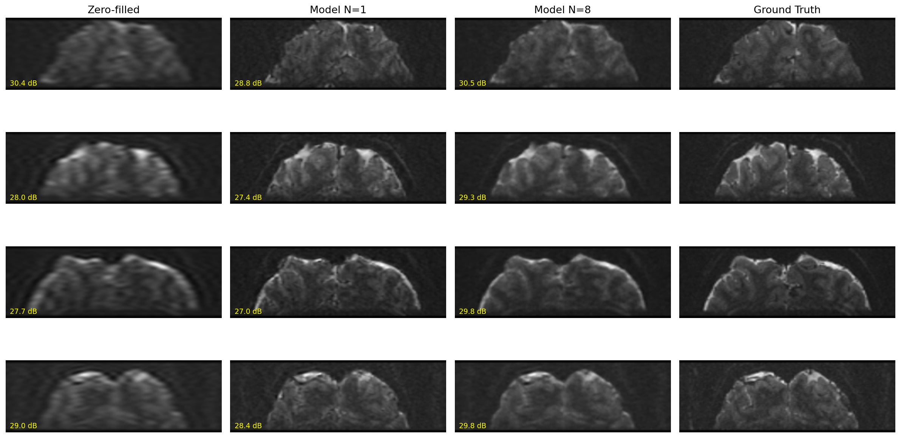
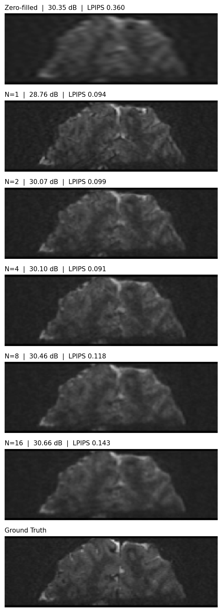
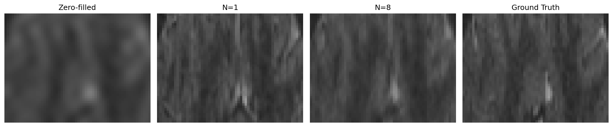

# sd-lora-fmri-superres

Latent diffusion super-resolution for 7T fMRI-EPI brain images: a **channel-conditioned
Stable Diffusion UNet** trained with LoRA, followed by **k-space data consistency**.

This is a companion to [`ddpm-ddrm-fmri-superres`](https://github.com/ozgursntrk/ddpm-ddrm-fmri-superres),
which attacks the same inverse problem with a from-scratch DDPM prior and DDRM. The degradation
operator, the subject split, and the metric space are kept identical, so the two approaches sit
on the same ground and the numbers can be read side by side.



---

## The problem

An MR scanner acquiring a low-resolution image samples fewer k-space lines. The physically
correct forward operator is therefore frequency-domain truncation, not spatial averaging —
the artifact is smooth blur plus Gibbs ringing along the brain/background boundary, not blocky
pixelation. At 4x on a 128x128 slice, 31x31 = 961 of 16384 coefficients survive.

The operator is inherited unchanged from the companion repo. What differs here is the prior:
instead of a pixel-space DDPM trained from scratch, a pretrained latent diffusion model is
adapted to this data with 3.2M trainable parameters.

## How it works

### 1. The VAE sets a hard ceiling — measure it first

Stable Diffusion never touches pixels directly. Every output passes through a VAE encode/decode
round trip, and that round trip is lossy. Its reconstruction PSNR is an upper bound on the whole
method, no matter how well the diffusion model performs. SD 1.5's VAE was trained on natural RGB
photographs; 7T EPI is far outside that distribution, so the bound is worth measuring before
committing to any training.

| Upscale | Input | Latent | VAE ceiling |
|---|---|---|---|
| 1x | 128x128 | 16x16 | 29.43 dB |
| 2x | 256x256 | 32x32 | **36.16 dB** |
| 4x | 512x512 | 64x64 | 44.29 dB |

At native resolution the ceiling sits about 1 dB above the untouched degraded image — the
method would have been dead on arrival, and would have failed for a reason invisible in the
training loss. 2x buys roughly 8 dB of headroom; 4x buys 8 dB more for four times the compute,
which is not needed. **All experiments use 2x: 256x256 pixels, 32x32 latent.**

### 2. Channel conditioning, not img2img

`conv_in` is widened from 4 to 8 channels and the degraded latent is concatenated to the noisy
latent at every denoising step. In img2img the degraded image only sets the starting point and
the model can drift away from it; here the condition is re-supplied at every step and cannot be
forgotten.

The new weights are zero-initialised, so training starts from behaviour identical to stock SD
and the model learns to use the condition gradually — the same idea as ControlNet's zero
convolutions. LoRA (r=16) is applied to the attention projections; `conv_in` is trained in full
and saved alongside the adapters. Total: 3,212,096 parameters, 0.37% of the model.

Text conditioning is dropped entirely. Every image belongs to one class, so a fixed prompt
carries no information; the empty-string embedding is computed once and frozen.

### 3. Data consistency

After decoding, the measured k-space coefficients are written back into the prediction. The
model is left free to synthesise only the frequencies that were never acquired. Without this
the output is merely plausible; with it, the output cannot contradict the measurement.

It is applied once after decoding rather than at every step: per-step enforcement would need a
VAE round trip each time, and that round trip is itself lossy, so the error would accumulate
over 50 steps. This is a simplified version of what DDRM enforces analytically.

---

## Results

Held-out subjects 17–22, 4x truncation, metrics in the 128x128 space.

**Data consistency helps consistently, if modestly** (30 slices):

| Method | PSNR | SSIM | LPIPS |
|---|---|---|---|
| Zero-filled | **29.72** | **0.797** | 0.365 |
| Model | 27.48 | 0.728 | 0.097 |
| Model + DC | 28.21 | 0.733 | **0.095** |

The wider result is the split verdict: fidelity metrics prefer the untouched blur, while LPIPS
prefers the model by almost a factor of four. Same images, opposite ranking. A blurred
reconstruction is genuinely hard to beat on MSE, because invented texture is statistically
right but not pixel-aligned.

### Sample averaging traces the trade-off curve

Each sample draws different high-frequency detail while the underlying anatomy stays fixed, so
averaging suppresses invented texture and preserves structure. As the sample count grows the
estimate approaches the posterior mean, which by definition minimises squared error — PSNR is
expected to rise and perceptual quality to fall.

| Samples | PSNR | SSIM | LPIPS |
|---|---|---|---|
| Zero-filled | 29.96 | 0.803 | 0.361 |
| N = 1 | 28.35 | 0.733 | 0.092 |
| N = 2 | 29.66 | 0.781 | **0.086** |
| N = 4 | 29.83 | 0.787 | 0.093 |
| N = 8 | **30.55** | **0.814** | 0.116 |



One knob, one trained model, the whole perception–distortion curve. A single sample loses on
fidelity and wins decisively on perception; averaging eight beats the baseline on **all three
metrics at once**, so the method does not rest on arguing that LPIPS matters more than PSNR.

LPIPS is not monotonic — it bottoms out at N=2 and degrades after. Light averaging removes
incorrect texture; heavy averaging removes correct texture too.



### A note on the DDRM baseline

Measured on the same 288 held-out slices with the same operator, the untouched zero-filled
reconstruction scores 33.67 dB at 2x and 28.88 dB at 4x — above the 33.14 / 28.41 dB reported
for DDRM in the companion repo.

DDRM was run with `eta=0.85`, so its sampler injects noise and synthesises detail that is
plausible but not pixel-aligned, and MSE penalises exactly that. This does not touch that
repo's actual claim, which compares two *inverse problems* (k-space truncation beats spatial
averaging under DDRM in every setting) rather than claiming restoration gains over doing
nothing. It does mean PSNR alone was the wrong lens, which is why LPIPS appears throughout here.

These numbers come from re-deriving the degradation in this notebook; small differences from
the original preprocessing cannot be ruled out.

---

## Setup

```
conda create -n fmri-sd python=3.10
conda activate fmri-sd
pip install torch torchvision diffusers transformers peft accelerate
pip install numpy pillow matplotlib pandas scikit-image lpips tqdm
```

### Data

The high-resolution source is [ds001168](https://openneuro.org/datasets/ds001168) on OpenNeuro —
0.75 mm prefrontal 7T EPI. PNG slices are produced by notebook 02 of the
[companion repo](https://github.com/ozgursntrk/ddpm-ddrm-fmri-superres): subjects 01–16 give 768
training slices, 17–22 give 288 held-out slices. The split is by subject, since neighbouring
slices of the same subject are nearly identical and a slice-wise split would leak information.

Point `TRAIN_DIR` and `TEST_DIR` in the notebook at those folders and run top to bottom.

### Training

50 epochs at batch size 4, roughly 0.9 min/epoch on an RTX 5070 Ti — about 45 minutes.
Checkpoints (adapters plus optimizer state) are written every 25 epochs.

Mixed precision uses bfloat16 autocast with fp32 master weights rather than pure fp16: bf16
shares the exponent range of fp32, so no gradient scaler is needed and small gradients do not
flush to zero.

---

## Limitations

- Trained for 50 epochs; no saturation study against the 25-epoch checkpoint. The companion
  repo found its prior saturated well before the final step count, so the same may apply here.
- Metrics computed on 15–30 held-out slices rather than all 288. Differences of a few tenths of
  a dB are within noise at that sample size.
- One degradation factor (4x), noise-free only. The companion study found the largest advantage
  under measurement noise, which is untested here.
- Data consistency applied once after decoding, not at every denoising step.
- Single trained model, single LoRA rank; no seed-variance or hyperparameter study.
- Metrics are computed in the resized 128x128 space, not at native resolution — relative
  comparisons are meaningful, absolute values less so.
- Sample averaging multiplies inference cost linearly; N=8 means eight full 50-step samplings
  per slice.

## Acknowledgements

- [Stable Diffusion 1.5](https://huggingface.co/runwayml/stable-diffusion-v1-5) — Rombach et al.,
  *High-Resolution Image Synthesis with Latent Diffusion Models*
- [LoRA](https://arxiv.org/abs/2106.09685) — Hu et al., via [PEFT](https://github.com/huggingface/peft)
- [DDRM](https://github.com/bahjat-kawar/ddrm) — Kawar et al., *Denoising Diffusion Restoration Models*
- [ds001168](https://openneuro.org/datasets/ds001168) — OpenNeuro

## License

MIT
